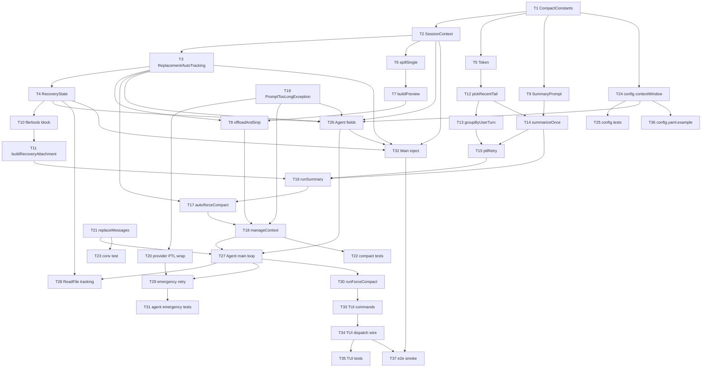

~~~Markdown
# 上下文管理 Tasks

本章把"两层压缩 + 压缩后恢复 + 手动 / 紧急入口"按 plan 的模块切分落到代码上。任务粒度控制在 2~5 分钟一个,每个任务都自包含:可以读完任务直接动手,不需要回看 plan。任务之间通过"依赖"字段标明顺序。

## 文件清单

| 文件路径 | 类型 | 职责 |
|----------|------|------|
| `src/main/java/com/bluecode/compact/CompactConstants.java` | 新建 | 全部硬编码常量 |
| `src/main/java/com/bluecode/compact/state/ContentReplacementState.java` | 新建 | `ContentReplacementState`(含 `decideOnce`)、`Decision` 枚举、`DecisionResult` record |
| `src/main/java/com/bluecode/compact/state/AutoCompactTrackingState.java` | 新建 | 熔断计数器 |
| `src/main/java/com/bluecode/compact/state/SessionContext.java` | 新建 | `SessionContext` record + `create(Path)` |
| `src/main/java/com/bluecode/compact/Recovery.java` | 新建 | `RecoveryState` / `FileReadRecord` / `buildRecoveryAttachment` / `renderFileBlock` / `renderToolsBlock` / `BOUNDARY_NOTICE` |
| `src/main/java/com/bluecode/compact/Token.java` | 新建 | `estimateTokens` / `usageAnchor` / `messageChars` |
| `src/main/java/com/bluecode/compact/// (Layer 1/2 都在 ContextCompactor.java 内)` | 新建 | `offloadAndSnip` / `spillSingle` / `buildPreview` |
| `src/main/java/com/bluecode/compact/SummaryPrompt.java` | 新建 | `buildSummaryPrompt` / `serializeConversation` / `extractSummary` / 9 部分模板 |
| `src/main/java/com/bluecode/compact/// (Layer 1/2 都在 ContextCompactor.java 内)` | 新建 | `autoCompact` / `forceCompact` / `runSummary` / `summarizeOnce` / `ptlRetry` / `pickRecentTail` / `groupByUserTurn` |
| `src/main/java/com/bluecode/compact/ContextCompactor.java` | 新建 | `manageContext` / `TriggerKind` 枚举 / 编排 |
| `src/main/java/com/bluecode/compact/CompactException.java` | 新建 | checked exception 基类 |
| `src/main/java/com/bluecode/compact/PromptTooLongException.java` | 新建 | 摘要 PTL 异常(若 llm 包未提供) |
| `src/test/java/dev/bluecode/compact/*Test.java` | 新建 | 各文件对应单测(JUnit 5) |
| `src/main/java/com/bluecode/llm/PromptTooLongException.java` | 新建 | `LlmException` 子类,作为 PTL 哨兵 |
| `src/main/java/com/bluecode/llm/AnthropicProvider.java` | 修改 | 把 provider 上下文过长错误包装成 `PromptTooLongException` 并通过 `AgentEvent.ErrorEvent` 投递 |
| `src/main/java/com/bluecode/llm/OpenAIProvider.java` | 修改 | 同上 |
| `src/test/java/dev/bluecode/llm/AnthropicProviderTest.java` | 修改/新建 | PTL 错误包装单测 |
| `src/test/java/dev/bluecode/llm/OpenAIProviderTest.java` | 修改/新建 | PTL 错误包装单测 |
| `src/main/java/com/bluecode/conversation/Conversation.java` | 修改 | 加 `ReentrantLock lock`;新增 `replaceMessages(msgs)` 深拷贝整体替换 |
| `src/test/java/dev/bluecode/conversation/ConversationTest.java` | 修改 | 增加 `replaceMessages` 用例 |
| `src/main/java/com/bluecode/config/ProviderConfig.java` | 修改 | record 追加 `int contextWindow` + `effectiveContextWindow()` |
| `src/main/java/com/bluecode/config/ProtocolDefaults.java` | 新建 | `DEFAULT_ANTHROPIC_CONTEXT_WINDOW` / `DEFAULT_OPENAI_CONTEXT_WINDOW` 协议默认值常量 |
| `src/test/java/dev/bluecode/config/ConfigLoaderTest.java` | 修改 | 4 种情况断言 + 加载 `.bluecode/config.yaml.example` 通过的解析测试 |
| `src/main/java/com/bluecode/agent/SessionRuntime.java` | 新建 | `SessionRuntime` 类 + Builder 整合 |
| `src/main/java/com/bluecode/agent/Agent.java` | 修改 | `Agent.builder().runtime(...)`;streamOnce 签名抛 `StreamException`;主循环集成 compact、ReadFile 追踪、PTL 紧急压缩、`runForceCompact`、`runLock` 互斥锁 |
| `src/main/java/com/bluecode/agent/CompactEvent.java` | 新建 | `CompactPhase` 枚举 + `CompactEvent` record(实现 `AgentEvent`) |
| `src/test/java/dev/bluecode/agent/AgentTest.java` | 修改 | FakeProvider 扩展 + 紧急压缩两用例 |
| `src/main/java/com/bluecode/tui/Commands.java` | 新建 | 命令分发 + `/exit` / `/plan` / `/do` / `/compact` 处理器 + 未知命令兜底 |
| `src/main/java/com/bluecode/tui/BlueCodeModel.java` | 修改 | 新增 `SessionRuntime runtime` 与 `Agent agent` 字段;构造期一次性构造 Agent;`submit()` 内原 switch 改用 `dispatchCommand` |
| `src/main/java/com/bluecode/tui/AgentEvent 队列.java` | 修改 | `onNext` 中新增 `CompactEvent` 分支,渲染状态提示 |
| `src/test/java/dev/bluecode/tui/BlueCodeModelTest.java` | 修改 | 5 组用例:`/compact` 路由到命令分发、`/unknown` 友好提示、迁移后 `/exit` / `/plan` / `/do` 各一组不回归 |
| `src/main/java/com/bluecode/BlueCode.java` | 修改 | 启动期构造 SessionRuntime 注入 BlueCodeModel;待 provider 选定后再注入 contextWindow |
| `src/main/java/com/bluecode/smoke/SmokeBlueCode.java` | 修改 | 按新 Agent 构造签名传入 SessionRuntime(smoke 场景 contextWindow=200000) |
| `.bluecode/config.yaml.example` | 修改 | 新增 `context_window` 字段示例与注释 |
| `.gitignore` | 修改 | 追加 `.bluecode/sessions/` |

---

## T1 - 建立 compact 包骨架与常量

- **文件**:`src/main/java/com/bluecode/compact/CompactConstants.java`
- **依赖**:无
- **步骤**:
  1. 新建目录 `src/main/java/com/bluecode/compact/`。
  2. 在 `CompactConstants.java` 顶部声明 `package com.bluecode.compact;`。
  3. 定义全部硬编码常量(`public static final`):`SINGLE_RESULT_LIMIT = 50000`、`MESSAGE_AGGREGATE_LIMIT = 200000`、`SUMMARY_RESERVE = 20000`、`AUTO_SAFETY_MARGIN = 13000`、`MANUAL_SAFETY_MARGIN = 3000`、`RECOVERY_FILE_LIMIT = 5`、`RECOVERY_TOKENS_PER_FILE = 5000`、`RECENT_KEEP_TOKENS = 10000`、`RECENT_KEEP_MESSAGES = 5`、`MAX_CONSECUTIVE_AUTO_COMPACT_FAILURES = 3`、`PTL_RETRY_LIMIT = 3`、`PTL_DROP_PERCENTAGE = 0.2`、`ESTIMATE_CHARS_PER_TOKEN = 3.5`、`PREVIEW_HEAD_BYTES = 2048`、`PREVIEW_HEAD_LINES = 20`。
  4. 类声明 `private CompactConstants() {}`,防止误实例化。协议默认值常量定义在 `com.bluecode.config.ProtocolDefaults`(见 T24),**不**放本类。
  5. 每个常量上方写一行简短中文注释,说明数字含义。注释不写"参考"、"取自"等外部引用语。
- **验证**:`./gradlew -q -pl . -am compile -DskipTests` 通过;`./gradlew -q spotless:check` 干净。

## T2 - SessionContext 与目录创建

- **文件**:`src/main/java/com/bluecode/compact/state/SessionContext.java`
- **依赖**:T1
- **步骤**:
  1. 创建 `state/SessionContext.java`,包声明 `package com.bluecode.compact.state;`。
  2. 定义 `public record SessionContext(String sessionId, Path spillDir)`。
  3. 实现包内静态方法 `private static String newSessionId()`:
     - 用 `SecureRandom.getInstanceStrong()` 取 4 字节;失败时降级为 `new SplittableRandom(System.nanoTime())` 取 4 字节 fallback,并写一条 `java.util.logging.Logger.warning` 日志。
     - `HexFormat.of().formatHex(bytes)` 编码后拼成 8 字符短随机串。
     - 返回 `Instant.now().getEpochSecond() + "-" + hex`。
  4. 实现 `public static SessionContext create(Path workspace) throws IOException`:
     - 调 `newSessionId()` 拿到 sessionId(不会 panic,SecureRandom 不可用时自动降级)。
     - 拼接 `spillDir = workspace.resolve(".bluecode/sessions").resolve(sessionId).resolve("tool-results")`。
     - 调 `Files.createDirectories(spillDir)`;目录已存在不算错误(`createDirectories` 本身幂等)。
     - 返回 `new SessionContext(sessionId, spillDir)`。
  5. import 顺序遵循 google-java-format:JDK 标准库一组、第三方一组、本地包一组。
- **验证**:编译通过;T22 增加 `testCreateWithFallbackRandom` 覆盖降级路径。

## T3 - ContentReplacementState 与 AutoCompactTrackingState

- **文件**:`src/main/java/com/bluecode/compact/state/ContentReplacementState.java` + `AutoCompactTrackingState.java`
- **依赖**:T2
- **步骤**:
  1. 在 `ContentReplacementState.java` 中定义类:
     ```java
     public final class ContentReplacementState {
         private final ReentrantLock lock = new ReentrantLock();
         private final Set<String> seenIds = new HashSet<>();
         private final Map<String, String> replacements = new HashMap<>();

         public enum Decision { KEPT, REPLACED, SKIP }
         public record DecisionResult(Decision decision, String preview) {}
         ...
     }
     ```
  2. 两本集合都是包内私有(`private`),不导出。
  3. 给 `ContentReplacementState` 加唯一高层方法:
     ```java
     /**
      * decideOnce 在持锁状态下完成"查账本 → 决策 → 写账本"原子操作。
      *
      * 若 id 已 Seen:直接返回账本中存量结果(KEPT 返回原 content,REPLACED 返回 replacements[id])。
      * 若 id 未 Seen:调 decide.get() 回调(仍在持锁状态):
      *   - 回调返回 KEPT → 写 seenIds,不写 replacements;返回原 content。
      *   - 回调返回 REPLACED → 写 seenIds + replacements;返回 preview。
      *   - 回调返回 SKIP(用于"落盘失败,本轮不写账本下轮重试")→ 既不写 seenIds 也不写 replacements;
      *     返回原 content。
      */
     public String decideOnce(String id, String original,
                              java.util.function.Supplier<DecisionResult> decide) {
         lock.lock();
         try {
             if (seenIds.contains(id)) {
                 return replacements.getOrDefault(id, original);
             }
             DecisionResult r = decide.get();
             return switch (r.decision()) {
                 case KEPT -> {
                     seenIds.add(id);
                     yield original;
                 }
                 case REPLACED -> {
                     seenIds.add(id);
                     replacements.put(id, r.preview());
                     yield r.preview();
                 }
                 case SKIP -> original;
             };
         } finally {
             lock.unlock();
         }
     }
     ```
     注意 `seenIds` 与 `replacements` 两本集合的写入必须在同一临界区内完成(持有 lock 期间),避免出现"已 Seen 但 replacement 未写"的中间态。
  4. 在 `AutoCompactTrackingState.java` 中定义类:`ReentrantLock lock`、`int consecutiveFailures`。
  5. 实现 `recordSuccess()` / `recordFailure()` / `tripped()`(`>= MAX_CONSECUTIVE_AUTO_COMPACT_FAILURES`),全部加锁。
- **验证**:编译通过;每个读/写临界区均加锁;decideOnce 是临界区入口。

## T4 - RecoveryState 与 FileReadRecord

- **文件**:`src/main/java/com/bluecode/compact/Recovery.java`
- **依赖**:T3
- **步骤**:
  1. 在同文件内定义 `public record FileReadRecord(String path, String content, Instant timestamp)`。
  2. 定义 `public final class RecoveryState`:`ReentrantLock lock`、`Map<String, FileReadRecord> files`(键为绝对路径)。
  3. 实现 `recordFile(String path, String content)`:加锁写入,若 path 不是绝对路径则 `Path.of(path).toAbsolutePath().normalize().toString()` 一次再存。
  4. 实现 `List<FileReadRecord> snapshot()`:加锁拷贝 map values,按 `timestamp` 倒序排序后返回 `List.copyOf(...)`(immutable)。
- **验证**:编译通过;自查 `snapshot` 返回的是拷贝,不暴露内部 map。

## T5 - estimateTokens 与 usageAnchor

- **文件**:`src/main/java/com/bluecode/compact/Token.java`
- **依赖**:T1
- **步骤**:
  1. 新建 `Token.java`,包声明 `package com.bluecode.compact;`。
  2. 定义 `public final class Token { private Token() {} ... }`。
  3. 实现 `public static long usageAnchor(Usage u)`:返回 `u.inputTokens() + u.outputTokens() + u.cacheRead() + u.cacheWrite()`(假设 Usage 是 record,字段为 long,避免溢出)。
  4. 实现包内 `static int messageChars(List<Message> msgs)`:遍历每条 message,累加 `content.getBytes(UTF_8).length` + 每个 `toolCalls.get(i).input` 字节长度(注意字段名是 `input`,类型 `JsonNode` 或 `String`)+ 每个 `toolResults.get(i).content` 长度。考虑 null 安全。
  5. 实现 `public static long estimateTokens(long anchor, List<Message> allMsgs, int anchorMsgLen)`:
     - 防御性处理 `int safeStart = Math.min(Math.max(anchorMsgLen, 0), allMsgs.size())`;
     - 取 `tail = allMsgs.subList(safeStart, allMsgs.size())`;
     - 返回 `anchor + (long) Math.ceil(messageChars(tail) / CompactConstants.ESTIMATE_CHARS_PER_TOKEN)`。
     - 入参语义:anchor 是上一次主对话 Stream 真实 usage 之和,anchorMsgLen 是当时 `conversation.size()`;只对锚点之后追加到 conversation 的消息做字符增量估算,避免重复计算历史。
- **验证**:编译通过;对 `anchor=0, allMsgs=[], anchorMsgLen=0` 返回 0;对 `anchor=1000, allMsgs=[m1, m2], anchorMsgLen=1`,结果 = `1000 + ceil(len(m2.content)/3.5)`。

## T6 - 单条工具结果落盘 spillSingle

- **文件**:`src/main/java/com/bluecode/compact/// (Layer 1/2 都在 ContextCompactor.java 内)`
- **依赖**:T2
- **步骤**:
  1. 新建 `// (Layer 1/2 都在 ContextCompactor.java 内)`,包声明 `package com.bluecode.compact;`。
  2. 实现包内 `static void spillSingle(SessionContext session, String toolUseId, String content) throws IOException`:
     - 拼接 `Path path = session.spillDir().resolve(toolUseId)`。
     - 用 `Files.exists(path)` 判断文件已存在则直接返回(幂等)。
     - 否则 `Files.writeString(path, content, UTF_8, StandardOpenOption.CREATE, StandardOpenOption.WRITE)`;失败抛 IOException。
  3. 包内的 helper 不导出(package-private)。
- **验证**:编译通过;手工写一个 main 测一次重复落盘,第二次 `Files.getLastModifiedTime` 不变(也可留到 T22 测试覆盖)。

## T7 - 预览体构造 buildPreview

- **文件**:`src/main/java/com/bluecode/compact/// (Layer 1/2 都在 ContextCompactor.java 内)`
- **依赖**:T6
- **步骤**:
  1. 实现 `static String headPreview(String content)`:先按 `\n` 分成最多 `PREVIEW_HEAD_LINES` 行(`String.split("\n", PREVIEW_HEAD_LINES + 1)` 后丢掉最后一段并 join),再用 `byte[] bytes = head.getBytes(UTF_8); if (bytes.length > PREVIEW_HEAD_BYTES) { head = new String(bytes, 0, PREVIEW_HEAD_BYTES, UTF_8); }` 二次裁剪。
  2. 实现 `static String buildPreview(int originalBytes, String head, Path spillPath)`:返回一个固定格式的多行字符串:
     - 第 1 行:`[content offloaded] original size: <originalBytes> bytes`
     - 第 2 行:`[saved to] <spillPath>`
     - 第 3 行:`[head preview]`
     - 后续若干行:`head` 内容
     - 末尾:固定文案"完整内容已保存到上述路径,如需查看请用文件读取工具读取该路径,不要凭头部预览猜测全文"
  3. 字符串构造用 `StringBuilder`,保证逐字节稳定输出。
- **验证**:编译通过;同一对入参连续两次调用 `buildPreview` 返回完全相等字符串(`String.equals`)。

## T8 - offloadAndSnip 主体

- **文件**:`src/main/java/com/bluecode/compact/// (Layer 1/2 都在 ContextCompactor.java 内)`
- **依赖**:T3、T7
- **步骤**:
  1. 实现 `public static List<Message> offloadAndSnip(List<Message> msgs, ContentReplacementState state, SessionContext session)`。
  2. 先深拷贝 msgs 到 `out`:`new ArrayList<>(msgs)` 后逐条复制每条 message 的 `toolResults` 列表(避免改原列表)。
  3. 关键约束:仅遍历 `Role == RoleTool` 的消息(bluecode 把一轮工具结果挂在 RoleTool 消息的 `toolResults` 列表里,**不**在 assistant 消息里)。对每条 RoleTool 消息独立处理其 `toolResults` 列表。
  4. 单遍扫描 + 候选列表处理(决策只走一次):
     - 对当前 RoleTool 消息的 toolResults 建立候选列表 `candidates`:先用 `state.decideOnce(id, content, () -> new DecisionResult(Decision.KEPT, null))` 探测已经决策过的项(账本会返回正确结果——KEPT 返回原 content、REPLACED 返回 preview),把这些项直接落到 `out` 对应位置;剩下未决策的项进入 `candidates`。
       注意:对已 Seen 项不允许重新调用 buildPreview,decideOnce 内部会复用 replacements[id]。
     - 把 `candidates` 按 `content.getBytes(UTF_8).length` 倒序排序,按下列顺序处理每个 candidate:
       a. `bytes > SINGLE_RESULT_LIMIT` 必须落盘;
       b. 否则若 `当前剩余聚合字节 > MESSAGE_AGGREGATE_LIMIT`,仍按倒序继续落盘下一个;
       c. 直至剩余聚合 ≤ MESSAGE_AGGREGATE_LIMIT 停手;
       d. 未被落盘的剩余项 KEPT。
     - 落盘逻辑:调用
       ```java
       state.decideOnce(id, content, () -> {
           try {
               spillSingle(session, id, content);
           } catch (IOException e) {
               return new DecisionResult(Decision.SKIP, null);  // 不写账本,下一轮重试
           }
           Path spillPath = session.spillDir().resolve(id);
           return new DecisionResult(Decision.REPLACED,
                   buildPreview(content.getBytes(UTF_8).length, headPreview(content), spillPath));
       });
       ```
       用返回值作为新的 `toolResults.get(j).content`。
     - 落盘 → 改写 content → 写账本三个动作通过 decideOnce 在同一临界区完成,任一步失败(spill 错)则三件都不做。
  5. 返回 `out`。落盘 I/O 错误内部已通过 SKIP 决策吞掉(保持原文 + 不写账本),方法本身正常返回。
- **验证**:编译通过;目测每个 candidate 只通过 decideOnce 走一次。

## T9 - 摘要 Prompt 模板与解析

- **文件**:`src/main/java/com/bluecode/compact/SummaryPrompt.java`
- **依赖**:T1
- **步骤**:
  1. 新建 `SummaryPrompt.java`,包声明同 T1。
  2. 定义包级常量 `private static final String SUMMARY_INSTRUCTION = """..."""`(text block,Java 15+),内容包含:
     - 第一阶段要求用 `<analysis>...</analysis>` 包裹分析草稿。
     - 第二阶段要求用 `<summary>...</summary>` 包裹正式摘要。
     - 正式摘要必须按 9 个固定小节顺序输出,每节用统一的标题格式:① 主要请求和意图、② 关键技术概念、③ 文件和代码段、④ 错误和修复、⑤ 问题解决过程、⑥ 所有用户消息原文(按时间顺序逐条保留)、⑦ 待办任务、⑧ 当前工作(最详细)、⑨ 可能的下一步。
     - 明确指示"不要调用任何工具,输出纯文本"。
  3. 实现 `public static List<Message> buildSummaryPrompt(List<Message> msgs)`:
     - 把原对话序列化成一段可读文本(每条按 `role: content` 拼接,附带 tool_calls / tool_results 简述)。
     - 返回长度为 1 的列表:一条 user 消息,内容为 `SUMMARY_INSTRUCTION + "\n\n[conversation]\n" + serialized`。
  4. 实现 `public static String extractSummary(String raw)`:
     - 在 raw 中查找最后一对 `<summary>` 与 `</summary>`,取中间正文 `strip()` 后返回。
     - 找不到时直接返回 raw(不抛错),让上层降级使用。
- **验证**:编译通过;手工对 `"abc<summary>xx</summary>yy"` 调用 `extractSummary` 得 `"xx"`。

## T10 - BOUNDARY_NOTICE 与单文件 / 工具 block 渲染

- **文件**:`src/main/java/com/bluecode/compact/Recovery.java`
- **依赖**:T4
- **步骤**:
  1. 在 `Recovery.java` 中追加:`public static final String BOUNDARY_NOTICE = """..."""`(text block):固定文案,明确告诉模型"需要文件原文、错误原文、用户原话时请使用文件读取工具重读对应路径,不要依据摘要内容做猜测"。
  2. 实现 `static String renderFileBlock(FileReadRecord rec)`:
     - 估算 limit 对应字符数 `int charLimit = (int) (RECOVERY_TOKENS_PER_FILE * ESTIMATE_CHARS_PER_TOKEN)`;
     - 若 `content.length() > charLimit`,**保留头部** `content.substring(0, charLimit)`,截掉尾部多余内容,并在尾部追加一行 `(content truncated)`;
     - 输出格式:`### <path>\n[read at] <ISO_INSTANT 时间>\n<content fragment>\n`(必要时含 `(content truncated)` 行)。
  3. 实现 `static String renderToolsBlock(List<Map<String, Object>/*tool schema*/> defs)`:
     - 遍历 defs,每个工具一行:`- <name>: <description>`,再缩进一行展示 `inputSchema` 的 JSON 紧凑串(用 Jackson `ObjectMapper.writeValueAsString(schema)`)。
- **验证**:编译通过;对超长 content 渲染后串尾出现 `(content truncated)`,头部内容保留前 `charLimit` 字符。

## T11 - buildRecoveryAttachment 三段拼接

- **文件**:`src/main/java/com/bluecode/compact/Recovery.java`
- **依赖**:T10
- **步骤**:
  1. 实现 `public static String buildRecoveryAttachment(List<FileReadRecord> snapshot, List<Map<String, Object>/*tool schema*/> toolDefs)`:
     - 入参 snapshot 必须由调用方(runSummary 入口)一次性拍好;本方法不直接持有 `RecoveryState`,避免渲染期间状态漂移。
     - 取 snapshot 前 `RECOVERY_FILE_LIMIT` 个(snapshot 已按时间戳倒序)。
     - 用 `StringBuilder` 拼三段:
       - `## 最近读过的文件\n` + 各 `renderFileBlock`;列表为空时写一行 `(无)`。
       - `## 当前可用工具\n` + `renderToolsBlock(toolDefs)`。
       - `## 边界提示\n` + `BOUNDARY_NOTICE`。
     - **返回 String**,不返回 Message:runSummary 会把摘要文本与本方法输出拼到同一条 user 消息的 content 里(避免 user/user 连续违反 anthropic 协议)。
  2. 方法纯函数,不修改任何外部状态。
- **验证**:编译通过;用相同入参连续调两次得到逐字节相等字符串(覆盖 C12 边界提示稳定性)。

## T12 - 近期原文 pickRecentTail + 配对修正

- **文件**:`src/main/java/com/bluecode/compact/// (Layer 1/2 都在 ContextCompactor.java 内)`
- **依赖**:T5
- **步骤**:
  1. 新建 `// (Layer 1/2 都在 ContextCompactor.java 内)`,包声明同 T1。
  2. 实现 `static List<Message> pickRecentTail(List<Message> msgs)`:
     - 从尾到头扫描,累计 tokens(用 T5 的 `messageChars` 单条估算)和条数。
     - 命中"累计 token ≥ RECENT_KEEP_TOKENS **且**条数 ≥ RECENT_KEEP_MESSAGES"(两个下界都满足后才停手——这是 spec F11 的"择宽"语义:同时满足两个下界,覆盖范围更大)就停止。
     - 设当前 startIdx,再做配对修正:若 `msgs.get(startIdx).role() == RoleTool`(落单的 tool_result),把 startIdx 往前推到上一个带 toolCalls 的 assistant 消息处。
     - 返回 `msgs.subList(startIdx, msgs.size())` 的拷贝(`List.copyOf` 或 `new ArrayList<>(...)`)。
  3. 注意空 msgs 直接返回 `List.of()`。
- **验证**:编译通过;手工构造 6 条短消息,第 1~3 条是一组 user/assistant/tool,第 4~6 是另一组;token 与条数两个下界都满足后停止,起点落在组首,不会切到 tool_result 单独。

## T12a - pickRecentTail 起点 role 衔接修正

- **文件**:`src/main/java/com/bluecode/compact/// (Layer 1/2 都在 ContextCompactor.java 内)`
- **依赖**:T12
- **步骤**:
  1. 实现包内 `static List<Message> joinAfterSummary(Message summaryAndRecovery, List<Message> recent)`:
     - 摘要+恢复消息固定 `role == RoleUser`(见 T16 决策)。
     - 若 `recent.isEmpty()`:直接返回 `List.of(summaryAndRecovery)`。
     - 若 `recent.get(0).role() == RoleUser`:在两者之间插入一条 assistant 衔接占位 `new Message(RoleAssistant, "(已加载上下文摘要与恢复信息。请继续。)")`,避免 user/user 连续违反 anthropic 协议。
     - 若 `recent.get(0).role() == RoleTool`:pickRecentTail 配对修正应该已经把起点前推到 assistant,这里再做一次防御性检查:若仍为 tool,则强行前移到第一条 assistant 或直接丢掉这条 tool。
     - 其他情况(assistant 开头):正常拼接。
  2. 返回拼接后的完整列表。
- **验证**:编译通过;T22 增加 `testJoinAfterSummaryAvoidsConsecutiveUser`。

## T13 - groupByUserTurn 分组

- **文件**:`src/main/java/com/bluecode/compact/// (Layer 1/2 都在 ContextCompactor.java 内)`
- **依赖**:T12
- **步骤**:
  1. 实现 `static List<List<Message>> groupByUserTurn(List<Message> msgs)`:
     - 遍历 msgs;每遇到 `role == RoleUser` 就开一个新组。
     - 同组追加:直到下一个 user 出现或遍历结束。
     - 第一条不是 user 时(少见),把它单独塞进第 0 组防止丢失。
  2. 不修改入参。
- **验证**:编译通过;对 `[u, a, t, u, a]` 返回长度 2 的二维列表,第 0 组 3 条、第 1 组 2 条。

## T14 - summarizeOnce 单次摘要请求

- **文件**:`src/main/java/com/bluecode/compact/// (Layer 1/2 都在 ContextCompactor.java 内)`
- **依赖**:T9、T12
- **步骤**:
  1. 实现 `static String summarizeOnce(ContextCompactor.// (参数直接传入 manage 方法) in, List<Message> msgs) throws PromptTooLongException, IOException`:
     - `Request req = new Request(SummaryPrompt.buildSummaryPrompt(msgs), List.of() /* tools 留空 */)`(不传 system / reminder;Request 没有 model 字段,model 由 provider 自身持有)。
     - 通过 `CompletableFuture<String>` 桥接 `provider.stream(req)`:订阅 publisher,在 `onNext` 上累加 `TextDelta.text()` 到 `StringBuilder`,捕获 `Usage` 事件(但**不**回写 SessionRuntime.usageAnchor——摘要请求不更新主对话锚点),`onComplete` 时 `complete(builder.toString())`,`onError(t)` 时 `completeExceptionally(t)`。
     - `try { String raw = future.get(); } catch (ExecutionException e) { Throwable cause = e.getCause(); if (cause instanceof PromptTooLongException p) throw p; throw new IOException(cause); }`
     - 调 `SummaryPrompt.extractSummary(raw)` 返回。
- **验证**:编译通过;T22 添加 `testSummarizeOncePtlPassThrough` 验证 FakeProvider 投递 wrapped PTL 时 summarizeOnce 抛 PromptTooLongException。

## T15 - ptlRetry 摘要请求自重试

- **文件**:`src/main/java/com/bluecode/compact/// (Layer 1/2 都在 ContextCompactor.java 内)`
- **依赖**:T13、T14
- **步骤**:
  1. 实现 `static String ptlRetry(ContextCompactor.// (参数直接传入 manage 方法) in, List<Message> msgs, Throwable firstErr) throws CompactException, IOException`:
     - 用 `groupByUserTurn(msgs)` 得到 `groups`(可变 ArrayList)。
     - 前 `PTL_RETRY_LIMIT`(=3)次重试:每次 `groups.remove(0)`(丢最旧 1 组),把剩余组 flatten 回 `List<Message>` 调 `summarizeOnce`;成功返回;继续遇到 `PromptTooLongException` 累计重试次数。这一阶段总共发 4 次请求:1 次初始(由调用方在 firstErr 前已发出)+ 3 次重试。
     - 超过 3 次重试仍 PTL 后:每次按 `int drop = Math.max(1, (int) Math.ceil(groups.size() * PTL_DROP_PERCENTAGE))` 砍掉最前面 `drop` 组,继续重试,直到 `groups.isEmpty()`。
     - 全部丢光仍失败(即 groups 空时再调一次也会失败):抛 `new CompactException("ptl retry exhausted", lastErr)`,**不**发送 messages 为空的请求。
  2. 中间任何"非 PTL"错误立即上抛,不再重试。
- **验证**:编译通过;T22 增加 `testPtlRetryDropsExactlyOneGroupPerStep` 与 `testPtlRetryStopsBeforeEmptyMessages`。

## T16 - runSummary 摘要 + 恢复 + 近期原文拼接

- **文件**:`src/main/java/com/bluecode/compact/// (Layer 1/2 都在 ContextCompactor.java 内)`
- **依赖**:T11、T12a、T14、T15
- **步骤**:
  1. 实现 `static List<Message> runSummary(ContextCompactor.// (参数直接传入 manage 方法) in) throws CompactException`:
     - 取 `List<Message> oldMsgs = in.conv().messages()`。
     - **入口拍快照**:`List<FileReadRecord> recoverySnapshot = in.recovery().snapshot()`;后续渲染只用这一份快照。
     - 调 `summarizeOnce(in, oldMsgs)`;若抛 `PromptTooLongException` 走 `ptlRetry(in, oldMsgs, e)`;最终拿到 `summaryText`(PTL 重试用光的错误直接上抛给调用方)。
     - 调 `Recovery.buildRecoveryAttachment(recoverySnapshot, in.toolDefs())` 得到恢复内容字符串。
     - 把摘要和恢复合并到同一条 user 消息:
       ```java
       String combined = "## 历史会话摘要\n" + summaryText + "\n\n" + recoveryText;
       Message summaryAndRecovery = new Message(Role.USER, combined);
       ```
     - 调 `pickRecentTail(oldMsgs)` 得到近期原文列表。
     - 调 `joinAfterSummary(summaryAndRecovery, recentTail)` 拼接,保证不出现 user/user 连续。
     - 返回拼接后 msgs。
- **验证**:编译通过。

## T17 - autoCompact 与 forceCompact

- **文件**:`src/main/java/com/bluecode/compact/// (Layer 1/2 都在 ContextCompactor.java 内)`
- **依赖**:T16、T3
- **步骤**:
  1. 实现 `public static CompactResult autoCompact(ContextCompactor.// (参数直接传入 manage 方法) in) throws CompactException`:
     - `long beforeTok = in.estimatedToken()`。
     - 调 `runSummary(in)`。整轮失败(包括 runSummary 内部 ptlRetry 用光的情况):`in.autoTracking().recordFailure()`;抛 `CompactException`。
     - 成功:`in.autoTracking().recordSuccess()`;用 `Token.estimateTokens(0, newMsgs, 0)` 算 `afterTok`;返回 `new CompactResult(newMsgs, beforeTok, afterTok)`。
  2. 实现 `public static CompactResult forceCompact(ContextCompactor.// (参数直接传入 manage 方法) in) throws CompactException`:
     - 与 autoCompact 类似,但**不调用** autoTracking 任何方法。
     - 失败也不计入熔断。
- **验证**:编译通过。

## T18 - manageContext 编排入口

- **文件**:`src/main/java/com/bluecode/compact/ContextCompactor.java`
- **依赖**:T8、T17
- **步骤**:
  1. 新建 `ContextCompactor.java`,包声明同 T1。
  2. 定义 `public enum TriggerKind { AUTO, MANUAL, EMERGENCY }`。
  3. 定义 `public record // (参数直接传入 manage 方法)(...)`(按 plan 字段清单:含 `List<Map<String, Object>/*tool schema*/> toolDefs`、`long usageAnchor`、`int anchorMsgLen`、`long estimatedToken` 等)与 `public record String/*compactMsg*/(long beforeTokens, long afterTokens)`。
  4. 实现 `public static String/*compactMsg*/ manage(// (参数直接传入 manage 方法) in) throws CompactException`:
     - **MANUAL 分支**:跳过 layer1、阈值、熔断;直接 `forceCompact`;成功后 `in.conv().replaceMessages(result.newMsgs())`;返回 `new String/*compactMsg*/(in.estimatedToken(), result.afterTok())`。
     - **EMERGENCY 分支**:
       - 先强制跑一次 `ContextCompactor.manage(in.conv().messages(), in.replacement(), in.session())` 把大工具结果挪走,`in.conv().replaceMessages(layer1Out)`。
       - 再调 `forceCompact`;写回 conversation;返回 beforeTokens/afterTokens。
     - **AUTO 分支**:
       - a. `List<Message> layer1Out = ContextCompactor.manage(in.conv().messages(), in.replacement(), in.session())`;`in.conv().replaceMessages(layer1Out)`(无论是否触发 layer2 都必须写回,否则 layer1 的替换不会作用到下一次 streamOnce)。
       - b. 重新算 `long estTokens = Token.estimateTokens(in.usageAnchor(), layer1Out, in.anchorMsgLen())`(**必须用 layer1Out**,不能用 in.estimatedToken,否则 layer1 节省的 token 不被反映在阈值判断里)。
       - c. **sanity check**:若 `in.contextWindow() <= SUMMARY_RESERVE + AUTO_SAFETY_MARGIN`(即 ≤ 33000),跳过自动 layer2 并写一条 warning 日志,避免阈值为负造成死循环。
       - d. `long threshold = in.contextWindow() - SUMMARY_RESERVE - AUTO_SAFETY_MARGIN`;若 `estTokens < threshold || in.autoTracking().tripped()`:直接返回 `new String/*compactMsg*/(in.estimatedToken(), estTokens)`,仅 layer1 生效。
       - e. 否则调 `ContextCompactor.manage(in)`;成功后 `in.conv().replaceMessages(result.newMsgs())`;返回 `new String/*compactMsg*/(in.estimatedToken(), result.afterTok())`。
- **验证**:编译通过;（代码风格由 IDE 保证） 检查干净。

## T19 - PromptTooLongException 哨兵

- **文件**:`src/main/java/com/bluecode/llm/PromptTooLongException.java`
- **依赖**:无
- **步骤**:
  1. 新建 `PromptTooLongException.java`,包声明 `package com.bluecode.llm;`。
  2. 定义 `public class PromptTooLongException extends LlmException { public PromptTooLongException(Throwable cause) { super("prompt too long for context window", cause); } }`(若 `LlmException` 不存在,则继承 `IOException` 或新建一个 `LlmException extends Exception` 基类)。
  3. `Map<String, Object>/*tool schema*/` 已是公开 record(见 com.bluecode.llm.Map<String, Object>/*tool schema*/)且字段 `name` / `description` / `inputSchema` 都已公开,本任务**不**改名、**不**新增公开动作。
- **验证**:编译通过;`grep -rn PromptTooLongException src/main/java/com/bluecode/llm/` 命中。

## T20 - Anthropic / OpenAI provider PTL 错误包装

- **文件**:`src/main/java/com/bluecode/llm/AnthropicProvider.java` / `OpenAIProvider.java`
- **依赖**:T19
- **步骤**:
  1. AnthropicProvider 错误分支:检测原始错误是否符合"上下文过长"特征(HTTP 状态 400 且响应体含 `prompt is too long`,或错误类型 `invalid_request_error` 且消息含 `context_length`)。命中时 `Throwable wrapped = new PromptTooLongException(origErr)`,通过 `publisher.submit(new AgentEvent.ErrorEvent(wrapped))` 投递到事件流(`Provider.stream` 接口签名只返回 `BlockingQueue`,无 throws,PTL 错误必须以 `AgentEvent.ErrorEvent` 形式发出)。
  2. OpenAIProvider 错误分支:检测 HTTP 400 + `code == "context_length_exceeded"`,同样 wrap 后通过 `AgentEvent.ErrorEvent` 投递。
  3. 其他错误维持原行为(直接以 `AgentEvent.ErrorEvent(origErr)` 投递原 err,不做 PTL wrap)。
- **验证**:编译通过。

## T20.5 - Anthropic / OpenAI provider PTL 错误包装单测

- **文件**:`src/test/java/dev/bluecode/llm/AnthropicProviderTest.java` / `OpenAIProviderTest.java`
- **依赖**:T20
- **步骤**:
  1. 注入构造好的错误返回(mock OkHttpClient 或注入预构造错误对象)。
  2. 断言:① 典型的 `prompt_too_long` / `context_length_exceeded` 原始错误被 stream 转换成 wrapped error 并以 `AgentEvent.ErrorEvent` 投递;② `failed.error() instanceof PromptTooLongException` 命中(验证用 `getCause()` 链);③ 其他 4xx / 5xx 错误不被错误地包装为 PTL(`instanceof` 返回 false)。
- **验证**:`./gradlew -q test -Dtest='Anthropic*|OpenAI*'` 通过。

## T21 - Conversation.replaceMessages + 并发安全

- **文件**:`src/main/java/com/bluecode/conversation/Conversation.java`
- **依赖**:无
- **步骤**:
  1. 给 `ConversationManager` 类新增 `private final ReentrantLock lock = new ReentrantLock()` 字段(当前 Conversation 没有 lock)。
  2. 给现有 `addUser` / `addAssistant` / `addAssistantWithToolCallComplete` / `addToolResults` / `messages` / `size` / `lastRole` 全部加锁(写操作 lock/unlock,读操作同样加锁,避免并发读写竞态)。
  3. 新增 `public void replaceMessages(List<Message> msgs)`:
     - 加锁。
     - 深拷贝:先 `new ArrayList<Message>(msgs.size())`,逐条复制;每条内的 `toolCalls` / `toolResults` 列表再单独 `new ArrayList<>(...)`;不暴露原入参引用。
     - 直接替换内部 `messages` 列表。
- **验证**:编译通过;T23 加并发用例覆盖 lock。

## T22 - compact 包单元测试

- **文件**:`src/test/java/dev/bluecode/compact/StateTest.java` / `Layer1Test.java` / `SummaryPromptTest.java` / `RecoveryTest.java` / `TokenTest.java` / `Layer2Test.java` / `CompactTest.java` / `support/FakeCompactProvider.java`
- **依赖**:T1~T18
- **步骤**:
  1. **support/FakeCompactProvider.java**(测试 helper):脚本化驱动 `List<List<StreamEvent>>`,支持按调用次数返回不同错误(覆盖 PromptTooLongException 与其他错误);在最后一帧之前发送 Usage 事件。compact 包内部测试统一用这个 helper。**不要** import `com.bluecode.agent` 的 FakeProvider(包私有不可见)。
  2. `StateTest.java`:
     - `testCreateSessionContext`:验证 `<unix>-<hex>` 格式,目录创建成功。
     - `testCreateWithFallbackRandom`:用反射或包内 hook 模拟 SecureRandom 失败,验证降级到 SplittableRandom 仍能返回合法 ID(不抛)。
     - `testDecideOnceFreezeKept`:decideOnce(id, ..., decide KEPT) 之后再次 decideOnce 返回原 content,账本不翻转。
     - `testDecideOnceFreezeReplaced`:decideOnce(id, ..., decide REPLACED) 之后再次 decideOnce 返回同一份 preview(逐字节相等)。
     - `testDecideOnceSkipDoesNotMark`:decideOnce 回调返回 SKIP → 下一次 decideOnce 仍可走 decide 回调(账本未写入)。
     - `testRecoveryStateSnapshotOrder`:snapshot 按时间倒序。
     - `testRecoveryStateConcurrent`:50 个 virtual thread 并发 recordFile + snapshot,JUnit 用 `assertDoesNotThrow` 包裹 `Thread.startVirtualThread` 集合,无 ConcurrentModificationException。
     - `testAutoTrackingConsecutiveBudget`:连续 recordFailure 两次 → tripped()=false;插入 recordSuccess → 计数清零;再 recordFailure 两次 tripped()=false;第 3 次 tripped()=true。
     - `testAutoTrackingConcurrent`:多 virtual thread 并发 recordSuccess / recordFailure / tripped 无 race(覆盖 AC23c)。
  3. `TokenTest.java`:
     - `testEstimateTokensAnchor`:anchor=0/anchorMsgLen=0 → 纯字符;anchor=1000, msgs=[m1, m2], anchorMsgLen=1 → 1000 + ceil(len(m2)/3.5)。
     - `testEstimateTokensLongNoOverflow`:anchor=2_000_000_000L, 大消息累加,不触发 long 溢出。
     - `testUsageAnchorSum`:四个字段相加,返回 long。
  4. `Layer1Test.java`:
     - `testSpillSingleIdempotent`:连续两次 spillSingle,文件 mtime 不变。
     - `testOffloadSingleResult`:单条 60000 字节 → 被替换;落盘文件存在;预览体头部 ≤ 20 行且 ≤ 2048 字节。
     - `testOffloadAggregate`:1 条 RoleTool 消息内 3 条 80000 字节工具结果 → 至少 2 条被替换,聚合回落到 ≤ 200000。
     - `testOffloadDecisionFreeze`:同一 id 跑两次 offloadAndSnip,第二次结果与第一次逐字节一致。
     - `testOffloadSpillFailureRetryable`:把 spillDir 改成不可写目录(`Files.setPosixFilePermissions`),验证落盘失败时该条不被替换,且账本中该 id 仍未 Seen;下一轮 offloadAndSnip 再次尝试 spill 一次。
     - `testPreviewStableAcrossRounds`:同一 (originalBytes, head, spillPath) 两次 buildPreview 返回逐字节相等字符串;同时验证不会被第二次 offloadAndSnip 重新构造。
  5. `SummaryPromptTest.java`:
     - `testBuildSummaryPromptShape`:返回 1 条 user 消息且包含 9 部分小节标题(字面字符串匹配)+ `<analysis>` / `<summary>` 标签说明 + "不要调用任何工具"。
     - `testSerializeConversationDeterministic`:相同 msgs 两次序列化返回逐字节相等。
     - `testExtractSummary`:三个 case(标准、缺失、嵌套),缺失时返回原文。
  6. `RecoveryTest.java`:
     - `testRenderFileBlockTruncate`:超长内容保留头部并在尾部出现 `(content truncated)`(**头部**保留、**尾部**截掉)。
     - `testBuildRecoveryAttachmentLimit`:放 7 条 record,输出只含最近 5 条;第 6、第 7 条的路径在输出中**不**出现(反向断言);5 条出现顺序与时间戳倒序一致(用 `String.indexOf` 比对位置)。
     - `testBuildRecoveryAttachmentToolsExact`:传入 toolDefs,输出文本能匹配每个工具名;用 `Set` 比对工具名集合 == 入参 defs 工具名集合。
     - `testBoundaryNoticeStable`:连续两次 buildRecoveryAttachment(相同 snapshot 与 toolDefs)输出逐字节相等(覆盖 C12)。
  7. `Layer2Test.java`:
     - `testPickRecentTailBoundary`:构造 token 边界与条数边界两种触发场景;验证"两个下界都满足"才停手。
     - `testPickRecentTailPairFix`:截断点夹在 tool_use/tool_result 中间 → 起点前移到 assistant tool_use 之前;列表首条 role 不是 tool。
     - `testJoinAfterSummaryAvoidsConsecutiveUser`:recent 首条是 user 时插入 assistant 衔接占位。
     - `testGroupByUserTurn`:标准用例。
     - `testPtlRetryDropsExactlyOneGroupPerStep`:前 3 次 PTL,第 4 次成功;FakeCompactProvider 记录每次请求里的 groups 数序列为 [G, G-1, G-2, G-3],第 4 次(G-3)成功。
     - `testPtlRetryFallToPercentage`:超过 3 次后按比例丢;断言每次 drop = ceil(剩余 * 0.2) 且 drop ≥ 1。
     - `testPtlRetryStopsBeforeEmptyMessages`:FakeCompactProvider 持续 PTL 直到 groups 耗尽,方法抛 CompactException,不发送 messages 为空的摘要请求。
  8. `CompactTest.java`:
     - `testManageContextAutoTriggersOnThreshold`:估算 token > 阈值 → 触发 autoCompact;conversation 被替换。
     - `testManageContextAutoSkippedBelowThreshold`:估算 token < 阈值 → 不触发 layer2(用 FakeCompactProvider.summarizeCalls 计数 == 0 断言,覆盖 AC5)。
     - `testManageContextAutoUsesLayer1Output`:layer1 把 60K 工具结果替换为预览体后,重新估算 token 跌到阈值以下时不再触发 layer2(覆盖 task T18 步骤 4b 重估行为)。
     - `testManageContextAutoSkippedWhenTripped`:autoTracking 标记为 tripped → 跳过 layer2。
     - `testManageContextAutoFailureRecordsFailure`:FakeCompactProvider 摘要抛 IOException → autoTracking.recordFailure 被调用;连续 3 次后 tripped()。
     - `testManageContextAutoPtlExhaustionCountsAsFailure`:FakeCompactProvider 持续抛 PTL 直到 groups 耗尽 → 该轮算一次失败,熔断计数 +1。
     - `testManageContextManualBypassesEverything`:trigger=MANUAL + 远低于阈值(estimated=500,window=200000)→ 仍执行 layer2;FakeCompactProvider.summarizeCalls == 1。
     - `testManageContextEmergencyRunsLayer1ThenForce`:trigger=EMERGENCY 时先执行 offloadAndSnip(断言落盘文件存在)再 forceCompact。
     - `testManageContextEmergencyBypassTracking`:人为让 autoTracking.tripped 仍能走 EMERGENCY 路径成功完成。
     - `testManageContextAutoUsageAnchorReplacedNotAccumulated`:FakeCompactProvider 脚本化连续 3 次返回不同 Usage(1000 / 1500 / 2200),主对话路径每次 stream 完成后 anchor 被替换为最新 Usage 之和(依次 1000 / 1500 / 2200),**不是**累加(覆盖 AC22)。
- **验证**:`./gradlew -q test -Dtest='com.bluecode.compact.*'` 全部通过。

## T23 - Conversation.replaceMessages 测试

- **文件**:`src/test/java/dev/bluecode/conversation/ConversationTest.java`
- **依赖**:T21
- **步骤**:
  1. 新增 `testReplaceMessagesDeepCopy`:构造 2 条 msg,调 replaceMessages,修改原列表后 `conv.messages()` 不被影响。
  2. 新增 `testReplaceMessagesEmpty`:传 null / 空列表不抛 NPE,messages() 返回长度 0。
  3. 风格遵循文件内已有断言风格(JUnit 5 `assertEquals`,不引入 parameterized test)。
- **验证**:`./gradlew -q test -Dtest='ConversationTest'` 通过。

## T24 - config Provider 新增 contextWindow 与默认值

- **文件**:`src/main/java/com/bluecode/config/ProviderConfig.java` + `src/main/java/com/bluecode/config/ProtocolDefaults.java`(新建)
- **依赖**:T1
- **步骤**:
  1. 新建 `ProtocolDefaults.java`,定义:
     ```java
     package com.bluecode.config;

     public final class ProtocolDefaults {
         public static final int DEFAULT_ANTHROPIC_CONTEXT_WINDOW = 200000;
         public static final int DEFAULT_OPENAI_CONTEXT_WINDOW    = 128000;

         private ProtocolDefaults() {}
     }
     ```
     默认值常量定义在 config 自身,**不**放 compact 包,避免 config → compact 反向依赖。
  2. `ProviderConfig` record 在最末位追加 `int contextWindow`。现有字段顺序与 SnakeYAML 字段映射**不动**(避免破坏现有解码)。
  3. 实现 `public int effectiveContextWindow()`:
     - 若 `contextWindow > 0` 返回该值。
     - 否则按 `protocol`:`"anthropic"` → `DEFAULT_ANTHROPIC_CONTEXT_WINDOW`、`"openai"` → `DEFAULT_OPENAI_CONTEXT_WINDOW`、其他返回 `DEFAULT_ANTHROPIC_CONTEXT_WINDOW`(保守)。
  4. `ConfigLoader.load(...)` 路径已是 SnakeYAML `Map<String, Object>` → record 绑定,新字段会被自动绑定(只要 yaml key 是 `context_window`,绑定逻辑取 `context_window` 写入 `contextWindow` 字段)。
- **验证**:编译通过;`grep -rn "import com.bluecode.compact" src/main/java/com/bluecode/config/` 无命中(config 不依赖 compact)。

## T25 - config 单元测试 4 种情况

- **文件**:`src/test/java/dev/bluecode/config/ConfigLoaderTest.java`
- **依赖**:T24
- **步骤**:
  1. `testEffectiveContextWindowUnconfigured`:anthropic + 不配置 → 200000。
  2. `testEffectiveContextWindowZero`:openai + 配置 0 → 128000。
  3. `testEffectiveContextWindowPositive`:anthropic + 配置 80000 → 80000。
  4. `testEffectiveContextWindowUnknownProtocol`:未知 protocol + 不配置 → 200000(保守默认)。
- **验证**:`./gradlew -q test -Dtest='ConfigLoaderTest'` 通过。

## T26 - Agent 与 SessionRuntime

- **文件**:`src/main/java/com/bluecode/agent/SessionRuntime.java`(新建)+ `src/main/java/com/bluecode/agent/Agent.java`(修改)
- **依赖**:T2、T3、T4、T19、T24
- **步骤**:
  1. 新建 `SessionRuntime.java`,定义:
     ```java
     package com.bluecode.agent;

     public final class SessionRuntime {
         public final ContentReplacementState replacement;
         public final RecoveryState recovery;
         public final AutoCompactTrackingState autoTracking;
         public final SessionContext session;
         public volatile int contextWindow;
         private final ReentrantLock anchorLock = new ReentrantLock();
         private long usageAnchor;    // 主对话路径 Stream 真实 usage 之和;摘要请求不更新
         private int  anchorMsgLen;   // anchor 当时 conversation.size()

         public SessionRuntime(...) { ... }

         public long getUsageAnchor() { anchorLock.lock(); try { return usageAnchor; } finally { anchorLock.unlock(); } }
         public int  getAnchorMsgLen() { anchorLock.lock(); try { return anchorMsgLen; } finally { anchorLock.unlock(); } }
         public void updateAnchor(long anchor, int msgLen) {
             anchorLock.lock();
             try { this.usageAnchor = anchor; this.anchorMsgLen = msgLen; }
             finally { anchorLock.unlock(); }
         }
     }
     ```
  2. 修改 `Agent` 类(字段保持 `private final`):
     - 新增 `SessionRuntime runtime`、`ReentrantLock runLock`。
  3. 修改 `Agent.Builder`:
     ```java
     public static Builder builder() { return new Builder(); }

     public static final class Builder {
         private SessionRuntime runtime;
         public Builder runtime(SessionRuntime r) { this.runtime = r; return this; }
         public Agent build() {
             if (this.runtime == null) {
                 // 测试场景下保留兼容:构造一个空 runtime,所有压缩动作不触发
                 this.runtime = SessionRuntime.empty(200000);
             }
             return new Agent(provider, registry, version, eng, runtime);
         }
     }
     ```
  4. 调整 `streamOnce` 签名为 `StreamResult streamOnce(...) throws StreamException`:
     - 内部从 `AgentEvent.ErrorEvent` 捕获错误,循环结束后 `throw new StreamException(capturedError)`;不再在内部 emit `AgentEvent.ErrorEvent(error)`(改由 run 在拿到 err 后统一 emit)。
     - 注意累加的 text 在 err 路径下**不**写回 Conversation(保持原子,紧急压缩可安全 replaceMessages)。
- **验证**:`./gradlew compileJava` 通过。

## T27 - Agent 主循环集成 manageContext

- **文件**:`src/main/java/com/bluecode/agent/Agent.java`
- **依赖**:T18、T21、T26
- **步骤**:
  1. 在 `run()` 入口 `runLock.lock()`,结束 `runLock.unlock()`(`try/finally`),保证不与 runForceCompact 并发触发 manageContext。
  2. 每轮迭代开头保留现有"按 mode 选 defs"逻辑:`List<Map<String, Object>/*tool schema*/> defs = registry.getAllSchemas(protocol)`,`mode == PermissionMode.PLAN` 时改为 `registry.readOnlyDefinitions()`。把同一份 `defs` 列表同时传给 `// (参数直接传入 manage 方法).toolDefs` 与 `streamOnce` 的 `Request.tools`。**不**缓存到 Agent 字段(避免 mode 切换或后续迭代复用旧列表)。
  3. 每轮 `streamOnce` 之前调 manageContext:
     ```java
     long anchor = runtime.getUsageAnchor();
     int  anchorLen = runtime.getAnchorMsgLen();
     int  cw = runtime.contextWindow;
     long est = Token.estimateTokens(anchor, conv.messages(), anchorLen);
     ContextCompactor.// (参数直接传入 manage 方法) in = new ContextCompactor.// (参数直接传入 manage 方法)(
             conv, provider, /*model*/null, cw, defs,
             runtime.replacement, runtime.recovery, runtime.autoTracking, runtime.session,
             anchor, anchorLen, est, ContextCompactor.TriggerKind.AUTO);
     try {
         ContextCompactor.manage(in);
     } catch (CompactException e) {
         emit(new AgentEvent.ErrorEvent(e));
         break;
     }
     ```
  4. streamOnce 完成后(主对话路径成功返回 usage 时):
     ```java
     if (usage != null) {
         runtime.updateAnchor(Token.usageAnchor(usage), conv.size());
     }
     ```
     摘要请求路径不走这条更新(在 Layer2.summarizeOnce 内不写 runtime)。
- **验证**:`./gradlew compileJava` 通过;`./gradlew -q spotless:check` 干净。

## T28 - Agent 在 ReadFile 后记录文件追踪

- **文件**:`src/main/java/com/bluecode/agent/Agent.java`
- **依赖**:T4、T26
- **步骤**:
  1. Hook 点:在 `runGuarded` / `runTool` 返回 `tool.Result` 之后、`results[i]` 被填回 `executeBatched` 的结果列表之前(同 virtual thread,工具 worker 内同步执行)。**必须**在 `conv.addToolResults(results)` 之前完成,保证下一次 manageContext 能看到本轮 ReadFile 记录。
  2. 判断条件:`calls.get(i).name().equals("ReadFile")`(bluecode 现有工具名以 `ReadFileTool.name()` 返回值为准)且 `tool.Result.isError() == false`(isError 来自 `tool.Result`,不是 `llm.ToolResult`)。
  3. 从 `ToolCall.input`(JsonNode 或 String)取参数:
     ```java
     Map<String, Object> args;
     try {
         args = objectMapper.readValue(calls.get(i).input(), new TypeReference<>() {});
     } catch (IOException e) {
         continue;  // 跳过
     }
     Object pathObj = args.get("path");
     if (!(pathObj instanceof String path) || path.isBlank()) continue;
     ```
     注意 ToolCall 字段是 `input` 不是 `arguments`,参数名以 `ReadFileTool` 定义的 Args 类为准(bluecode 现在用 `path`)。
  4. 解析绝对路径:`Path absPath = Path.of(path).toAbsolutePath().normalize();`;失败直接跳过。
  5. 同步读盘:`String content = Files.readString(absPath, UTF_8);`;`IOException` 直接跳过(recovery 缺一条无所谓)。
  6. 写入 recovery:`runtime.recovery.recordFile(absPath.toString(), content);`。
- **验证**:`./gradlew compileJava` 通过;自查只对 ReadFile 工具触发,其他工具不会写 recovery。

## T29 - Agent 紧急压缩 + 重试一次

- **文件**:`src/main/java/com/bluecode/agent/Agent.java`
- **依赖**:T18、T20、T27
- **步骤**:
  1. T26 已把 streamOnce 改为抛 `StreamException`。run 主循环在拿到 ex 后用 `ex.getCause() instanceof PromptTooLongException` 判断 PTL。
  2. 在 run 主循环里用一个迭代级局部变量 `boolean emergencyRetried = false` 锁定一次性重试:
     ```java
     for (int iter = 1; iter <= maxIterations; iter++) {
         boolean emergencyRetried = false;
         // ... manage(AUTO) ...
         StreamResult res;
         try {
             res = streamOnce(...);
         } catch (StreamException ex) {
             if (ex.getCause() instanceof PromptTooLongException && !emergencyRetried) {
                 // 紧急压缩
                 ContextCompactor.// (参数直接传入 manage 方法) in = <同 T27 的 // (参数直接传入 manage 方法),但 trigger=EMERGENCY>;
                 try {
                     ContextCompactor.manage(in);
                 } catch (CompactException ce) {
                     emit(new AgentEvent.ErrorEvent(ce));
                     break;
                 }
                 // 重置锚点 + 重估
                 runtime.updateAnchor(0L, 0);
                 long est2 = Token.estimateTokens(0L, conv.messages(), 0);
                 if (est2 >= runtime.contextWindow - MANUAL_SAFETY_MARGIN) {
                     // 不可恢复
                     emit(new AgentEvent.ErrorEvent(ex));
                     break;
                 }
                 emergencyRetried = true;
                 try {
                     res = streamOnce(...);
                 } catch (StreamException ex2) {
                     // 仍非 nil 或仍 PTL:按正常错误流程上抛,不再判断
                     emit(new AgentEvent.ErrorEvent(ex2));
                     break;
                 }
             } else {
                 emit(new AgentEvent.ErrorEvent(ex));
                 break;
             }
         }
         // ... 后续逻辑
     }
     ```
  3. 紧急路径里 forceCompact 内部如遇 PTL 走 ptlRetry,全程不调 autoTracking 任何方法。
- **验证**:`./gradlew compileJava` 通过。

## T29a - Agent emit Compact 状态事件(兑现 spec F24a / F24b)

- **文件**:`src/main/java/com/bluecode/agent/CompactEvent.java`(新建)、`src/main/java/com/bluecode/agent/Agent.java`、`src/test/java/dev/bluecode/agent/AgentTest.java`
- **依赖**:T27、T29
- **步骤**:
  1. 在 `com.bluecode.agent` 包定义事件类型:
     ```java
     public enum CompactPhase {
         BEFORE_AUTO, AFTER_AUTO, BEFORE_EMERGENCY, AFTER_EMERGENCY
     }

     public record CompactEvent(
             CompactPhase phase,
             long before,
             long after,
             Throwable error
     ) implements AgentEvent {}
     ```
  2. `AgentEvent` sealed interface 追加 `permits ..., CompactEvent`(保持其他子类型不变)。
  3. **自动路径 emit**(在 T27 主循环步骤 2 内,调 `ContextCompactor.manageContext` 之前):
     ```java
     boolean willSummarize = est >= runtime.contextWindow - 20000 - 13000;
     if (willSummarize) {
         emit(new CompactEvent(CompactPhase.BEFORE_AUTO, 0L, 0L, null));
     }
     ContextCompactor.String/*compactMsg*/ out;
     Throwable mcErr = null;
     try {
         out = ContextCompactor.manage(in);
     } catch (CompactException e) {
         mcErr = e;
         out = new ContextCompactor.String/*compactMsg*/(est, est);
     }
     if (willSummarize) {
         emit(new CompactEvent(CompactPhase.AFTER_AUTO,
                 out.beforeTokens(), out.afterTokens(), mcErr));
     }
     ```
     阈值未达不发任何 Compact 事件(layer 1 是静默操作)。
  4. **紧急路径 emit**(在 T29 紧急压缩分支内):调 `ContextCompactor.manageContext` with `trigger=EMERGENCY` 之前 emit `BEFORE_EMERGENCY`,返回后 emit `AFTER_EMERGENCY`(带 before/after/err)。
  5. AgentTest 新增两个用例:
     - `testAgentEmitsAutoCompactEvents`:FakeProvider 注入超大对话历史使 estimatedToken 越过阈值;运行 run 收集所有 AgentEvent;断言事件列表里依次出现 `BEFORE_AUTO` 然后 `AFTER_AUTO`(before > after,error == null)。
     - `testAgentEmitsEmergencyCompactEvents`:FakeProvider 第一次 stream 投递 PromptTooLongException、第二次正常;断言收到 `BEFORE_EMERGENCY` → `AFTER_EMERGENCY`,且后续 run 正常完成。
- **验证**:`./gradlew compileJava` 通过;`./gradlew -q test -Dtest='AgentTest#testAgentEmits*CompactEvents'` 通过。

## T30 - Agent runForceCompact 给 TUI 调

- **文件**:`src/main/java/com/bluecode/agent/Agent.java`
- **依赖**:T27
- **步骤**:
  1. 新增方法 `public ForceCompactResult runForceCompact(ConversationManager conv, List<Map<String, Object>/*tool schema*/> defs)`,其中 `record ForceCompactResult(long before, long after, Throwable error)`:
     - 入口 `runLock.lock()`,`try/finally unlock` 保证不与 run 并发。
     - 构造 // (参数直接传入 manage 方法)(同 T27),但 `trigger = TriggerKind.MANUAL`;`toolDefs` 由 TUI 传入(与下一次 run 的 defs 一致,避免独立计算)。
     - 调 `ContextCompactor.manageContext`;返回 `new ForceCompactResult(out.beforeTokens(), out.afterTokens(), null)`;失败时返回 `new ForceCompactResult(0, 0, e)`。
  2. 该方法可被 TUI 在 virtual thread 中阻塞调用。
- **验证**:`./gradlew compileJava` 通过。

## T31 - Agent 紧急压缩单元测试

- **文件**:`src/test/java/dev/bluecode/agent/AgentTest.java`
- **依赖**:T29
- **步骤**:
  1. 扩展现有 `FakeProvider`:① 在脚本最后一帧之前发 `new StreamEvent.Usage(...)`;② 支持按调用次数序列化错误投递(包括已被 wrap 成 `PromptTooLongException` 的错误),错误通过 `publisher.submit(new AgentEvent.ErrorEvent(wrapped))` 投递到事件流。
  2. `testAgentEmergencyCompactSucceeds`:第 1 次 stream 投递 PTL;FakeProvider 接收紧急压缩的摘要请求 → 返回正常摘要;第 2 次 stream(重试原请求)正常完成 → 整体成功。
  3. `testAgentEmergencyCompactReRaiseOnSecondPtl`:紧急压缩后的重试还投递 PTL → Agent 上抛错误(AgentEvent.ErrorEvent 命中),不再做第三次。
  4. `testAgentEmergencyCompactUnrecoverableWhenStillTooBig`:紧急压缩后重新估算的 token 仍 ≥ contextWindow - MANUAL_SAFETY_MARGIN → Agent 不发起第二次 stream 请求而是直接上抛错误。
- **验证**:`./gradlew -q test -Dtest='AgentTest'` 通过。

## T32 - Main 与 SmokeMain 入口改造

- **文件**:`src/main/java/com/bluecode/BlueCode.java` + `src/main/java/com/bluecode/smoke/SmokeBlueCode.java`
- **依赖**:T2、T3、T4、T26
- **步骤**:
  1. 启动阶段构造:
     - `SessionContext session = SessionContext.create(workspace);`(workspace = cwd 或 `Path.of(".")`)。
     - `ContentReplacementState replacement = new ContentReplacementState();`。
     - `RecoveryState recovery = new RecoveryState();`。
     - `AutoCompactTrackingState autoTracking = new AutoCompactTrackingState();`。
  2. `BlueCode.java`:若 providers 长度 == 1,启动期即可知 protocol → 直接计算 `int cw = providers.get(0).effectiveContextWindow();`,构造 `SessionRuntime runtime = new SessionRuntime(replacement, recovery, autoTracking, session, cw);` 注入 BlueCodeModel。若 providers > 1,让 BlueCodeModel 完成 provider 选择后再注入 contextWindow(在 BlueCodeModel 的 provider-selected 回调里调 `runtime.contextWindow = providerCfg.effectiveContextWindow();`)。
  3. `SmokeBlueCode.java`:同样按新 Agent 构造签名调用 `Agent.builder().provider(...).registry(...).runtime(runtime).build();`;smoke 场景 contextWindow 可固定 200000。
  4. Agent 内部由 BlueCodeModel 持有(见 T32.5):构造期一次性 `Agent.builder()...build();`,后续 beginTurn 不再重新构造 Agent。
- **验证**:`./gradlew -q package -DskipTests` 通过;启动 `java -jar build/libs/bluecode.jar` 后 `.bluecode/sessions/<id>/tool-results/` 目录存在。

## T32.5 - BlueCodeModel 持有 SessionRuntime 与 Agent 引用

- **文件**:`src/main/java/com/bluecode/tui/BlueCodeModel.java`
- **依赖**:T26、T32
- **步骤**:
  1. `BlueCodeModel` 类新增字段 `private final SessionRuntime runtime;` 与 `private Agent agent;`(package 中的 `Agent` 别名按需 import)。
  2. 构造期接收 `SessionRuntime runtime` 参数(Main 注入)。
  3. 若 providers 长度 == 1,构造期内即可 `this.agent = Agent.builder().provider(provider).registry(registry).version(version).engine(engine).runtime(runtime).build();`。
  4. 若多 provider,需在用户选定 provider 后再构造 Agent。把构造时机抽到一个 `ensureAgent()` 方法里,由 `beginTurn` 调一次(已构造时跳过)。
  5. `beginTurn` 改为:`BlockingQueue<AgentEvent> events = agent.run(turnCtx, conv, mode);`(不再每轮新建 Agent)。
- **验证**:`./gradlew compileJava` 通过。

## T33 - TUI 命令分发框架

- **文件**:`src/main/java/com/bluecode/tui/Commands.java`
- **依赖**:T30、T32.5
- **步骤**:
  1. 新建 `Commands.java`,包声明 `package com.bluecode.tui;`。
  2. 定义函数式接口 `@FunctionalInterface public interface CommandHandler { void handle(BlueCodeModel app); }`。
  3. 注册表初始填四项(迁移现有 `/exit` / `/plan` / `/do`,新增 `/compact`):
     ```java
     public static final Map<String, CommandHandler> BUILTIN_COMMANDS = Map.of(
             "/exit",    Commands::handleExit,
             "/plan",    Commands::handlePlan,
             "/do",      Commands::handleDo,
             "/compact", Commands::handleCompact);
     ```
  4. 实现 `public static Optional<CommandHandler> dispatchCommand(String input)`:
     - 不以 `/` 开头返回 `Optional.empty()`。
     - 否则在 BUILTIN_COMMANDS 找;未找到时返回一个内置 `unknownCommand` handler,通过 `app.pushSystemMessage("未知命令: " + input + ",可用命令: /exit /plan /do /compact")` 输出系统消息,返回 `Optional.of(handler)`。
  5. 实现 `handleCompact(BlueCodeModel app)`:
     - 在 `Thread.startVirtualThread(() -> { ... })` 里调 `app.getAgent().runForceCompact(app.getConv(), defs);`(`defs` 用 `app.getRegistry().definitions()` 或 `readOnlyDefinitions()`,与下一轮 run 一致)。
     - 完成后通过 `app.getTextGUI().getGUIThread().program.send()(() -> { ... })` 把 `(before, after, err)` 投回 UI 线程;UI 处理时通过 `app.pushSystemMessage(...)` 打印系统消息:成功 `"已压缩,token 从 X 降至 Y"`,失败 `"压缩失败: <err>"`。
     - **命令路径不调** `app.getConv().addUser(...)`,命令输入不进入对话历史。
  6. `handleExit` / `handlePlan` / `handleDo` 复制 BlueCodeModel 现有 switch 分支行为:
     - `handleExit`:调 `app.cancel()` + `app.getScreen().stopScreen();` + 退出主循环。
     - `handlePlan`:`app.setMode(PermissionMode.PLAN); app.getInputBox().setText(""); ...`;在 scrollback 输出相同的 noticeBlock。
     - `handleDo`:`app.setMode(PermissionMode.DEFAULT); app.getConv().addUser(Prompt.EXECUTE_DIRECTIVE); app.beginTurn(userBlock("/do"));`。
- **验证**:`./gradlew compileJava` 通过。

## T34 - TUI 输入路径接入 dispatchCommand

- **文件**:`src/main/java/com/bluecode/tui/BlueCodeModel.java`
- **依赖**:T33
- **步骤**:
  1. bluecode 现有 `BlueCodeModel.submit()` 内部已有针对 `/exit` / `/plan` / `/do` 的 switch 分支。把这段 switch 整段删除,改为统一的命令分发:
     ```java
     void submit() {
         String text = inputBox.getText().strip();
         if (text.isEmpty()) return;
         Optional<CommandHandler> handler = Commands.dispatchCommand(text);
         if (handler.isPresent()) {
             inputBox.setText("");
             syncInputHeight();
             handler.get().handle(this);
             return;
         }
         conv.addUser(text);
         beginTurn(userBlock(text));
     }
     ```
  2. 命令路径不写入 conversation、不调 LLM;系统消息只通过 scrollback Panel 渲染,不进入 `conv.messages()`。
- **验证**:`./gradlew compileJava` 通过;手动跑 tmux 启动 bluecode 输入 `/compact`、`/exit`、`/plan`、`/do` 验证行为;输入 `/unknown` 看到友好提示。

## T34a - TUI 渲染 Compact 状态事件(兑现 spec F24a / F24b)

- **文件**:`src/main/java/com/bluecode/tui/AgentEvent 队列.java`、`src/main/java/com/bluecode/tui/Commands.java`、`src/test/java/dev/bluecode/tui/BlueCodeModelTest.java`
- **依赖**:T29a、T34
- **步骤**:
  1. `AgentEvent 队列.onNext(AgentEvent event)` 中新增 `event instanceof CompactEvent c` 分支(优先级最高,先于 ToolEvent / TextEvent / Done 判断):
     ```java
     @Override
     public void onNext(AgentEvent event) {
         if (event instanceof CompactEvent c) {
             String text = Commands.formatCompactNotice(c);
             program.send(new AgentEventMessage(() -> scrollback.addComponent(noticeBlock(text)));
             subscription.request(1);
             return;
         }
         // ... 既有分支
     }
     ```
  2. `Commands.java` 新增 `public static String formatCompactNotice(CompactEvent ev)`,按 `phase` 返回:
     - `BEFORE_AUTO` → `"正在压缩上下文..."`
     - `BEFORE_EMERGENCY` → `"上下文撞墙,自动压缩中..."`
     - `AFTER_AUTO` / `AFTER_EMERGENCY` 成功(error == null) → `String.format("已压缩,token 从 %d 降至 %d", ev.before(), ev.after())`
     - After*(error != null) → `String.format("压缩失败:%s", ev.error().getMessage())`
  3. `handleCompact` 的 program.send() 回投路径复用 `formatCompactNotice`,把手动 `/compact` 完成后的 `(before, after, err)` 包装成一个 `new CompactEvent(CompactPhase.AFTER_AUTO, ...)` 走同一段渲染方法,保证自动 / 紧急 / 手动三条路径的文案完全一致。
  4. BlueCodeModelTest 新增 3 个用例:
     - `testTuiRendersBeforeAutoNotice`:注入 `new CompactEvent(BEFORE_AUTO, 0, 0, null)`,断言 scrollback 出现 `"正在压缩上下文..."` 且未写入 conv。
     - `testTuiRendersBeforeEmergencyNotice`:注入 `BEFORE_EMERGENCY`,断言出现 `"上下文撞墙,自动压缩中..."`。
     - `testTuiRendersAfterCompactNotice`:注入 `new CompactEvent(AFTER_AUTO, 167000, 12000, null)`,断言出现 `"已压缩,token 从 167000 降至 12000"`;再注入 error != null 的版本断言出现 `"压缩失败:..."`。
- **验证**:`./gradlew compileJava` 通过;`./gradlew -q test -Dtest='BlueCodeModelTest#testTuiRenders*Notice'` 通过。

## T35 - TUI 命令分发测试

- **文件**:`src/test/java/dev/bluecode/tui/BlueCodeModelTest.java`
- **依赖**:T34
- **步骤**:
  1. `testTuiSlashCompactRoutesToCommand`:注入一个 mockAgent,输入 `/compact` 后断言 `mockAgent.runForceCompactCalls == 1`、`mockAgent.runCalls == 0`(不调 LLM 主对话路径)。
  2. `testTuiUnknownSlashCommandFriendly`:输入 `/unknown` 后断言出现系统提示消息,且 `mockAgent.runCalls == 0`。
  3. `testTuiMigratedExitStillWorks`:输入 `/exit`,断言走命令路径调用 cancel + stopScreen,行为与迁移前一致。
  4. `testTuiMigratedPlanStillWorks`:输入 `/plan`,断言 mode 切到 PLAN,输出 noticeBlock,未调 run。
  5. `testTuiMigratedDoStillWorks`:输入 `/do`,断言 mode 切到 DEFAULT、conv 追加 ExecuteDirective 并启动一轮 run。
- **验证**:`./gradlew -q test -Dtest='BlueCodeModelTest'` 通过。

## T36 - 更新 config.yaml 示例

- **文件**:`.bluecode/config.yaml.example`
- **依赖**:T24
- **步骤**:
  1. 在每个 provider 示例项下加 `context_window: <值>` 字段。
  2. 上方加注释行:`# context_window 单位 token,可选;未配置时按 protocol 默认(anthropic 200000、openai 128000)。`
- **验证**:编写小测试 fixture,SnakeYAML Engine 把示例文件解析为 `Config` 不抛。

## T36a - .gitignore 追加 sessions 目录

- **文件**:`.gitignore`
- **依赖**:T2
- **步骤**:
  1. 在 .gitignore 末尾追加一行 `.bluecode/sessions/`。
  2. 提交时在 PR 说明中点出。
- **验证**:启动 bluecode 后跑一次工具调用,`git status` 干净(不出现 sessions 子目录)。

## T37 - 端到端冒烟(tmux 手测)

- **文件**:无(手测)
- **依赖**:T32、T34
- **步骤**:
  1. `./gradlew -q package -DskipTests` → 拿到 `build/libs/bluecode.jar`(或 `build/libs/bluecode` shaded jar)。
  2. 用 tmux 启动 `java -jar build/libs/bluecode.jar`,配置好 anthropic provider。
  3. 触发一次大文件 ReadFile(构造一个 80KB 文件)→ 观察 `.bluecode/sessions/<id>/tool-results/` 下出现该工具调用 id 的文件;下一轮请求里该工具结果展示成预览体。
  4. 连续多轮对话直到接近 context 上限。临时把 `context_window` 配成 **80000**(满足 80000 - 20000 - 13000 = 47000 仍为正数;contextWindow 必须 > 33000 才能让自动阈值有效),让前几轮工具结果先填到 ~50000 字符触发自动 layer2。观察自动压缩发生;TUI 不闪退,对话继续。
  5. 任意时刻输入 `/compact` → 看到系统消息 `已压缩,token 从 X 降至 Y`。
  6. 输入 `/unknown` → 看到未知命令提示,未发 LLM。
  7. 输入 `/exit` / `/plan` / `/do` → 行为与本章迁移前一致。
- **验证**:以上 7 步全部观察到预期行为,无未捕获异常、无死循环。

---

## 执行顺序



并行机会:
- T5(Token)可以与 T2~T4 并行。
- T9(SummaryPrompt)独立,可与 T2~T8 并行。
- T19(哨兵异常)独立,可与 T1 并行启动。
- T21(replaceMessages)独立,可与 T1~T20 并行。
- T24/T25(config)只依赖 T1,可与 T2~T23 并行。
- T36(yaml 示例)只依赖 T24。
- T22(compact 测试)可以拆细,多人分别认领 Layer1Test/Layer2Test/RecoveryTest 等子文件并行写。
- T35(TUI 测试)只依赖 T34。

关键路径:T1 → T2~T4 → T8、T16 → T17 → T18 → T27 → T29 → T31 → T32 → T37。
</content>

~~~